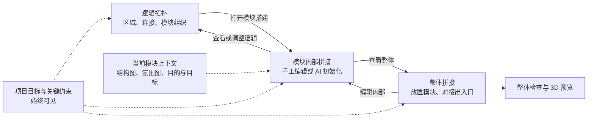

# 逻辑拓扑驱动搭建：流程与上下文优化方案

日期：2026-09-16

版本：v2，依据用户对拓扑复用、模块上下文和 AI 初始化的反馈重写。

状态：用户已确认，A+B 已进入本轮实现并同步需求基线。本文保留完整目标；当前交付限于第 8 节 A+B，C 和标明后续的能力不作为已实现项。自动测试、浏览器操作与 UE 实测证据分别记录，不因方案通过而视作验收通过。

## 1. 核心调整

主流程收敛成 **逻辑拓扑 ⇄ 拼接搭建**。模块划分在逻辑拓扑中完成；模块内部形态在拼接过程中形成和确定。独立的“拆解”“构型”页从主流程撤下。

上下文贯穿整个工具：项目目标和约束持续可见，模块专属资料随当前模块展示。AI 初始化是内部编辑器中的可选辅助，用户也可以直接手工搭建。

上一版的以下建议取消：

- 不再把“模块划分”保留为独立主步骤；现有分组操作合入逻辑拓扑。
- 不再要求先完成所有区域的空间定位，才能创建内部形态或编辑模块。
- 不再把上下文仅收进默认隐藏的资料抽屉。
- 不再通过独立构型页生成、套用，再跳到另一阶段编辑。

已有内容保护、候选预览与撤销、编辑保留来路、排版与空间坐标分开等原则继续保留。

## 2. 用户看到的流程



顶层只有“逻辑拓扑”和“拼接搭建”。搭建内通过“整体 > 当前模块”导航；检查、3D 预览和导出是操作或视图，不排成必经步骤。

允许先做一个模块再看整体，也允许先放模块占位再细化。其他模块未完成不阻止局部编辑。

## 3. 拓扑成为持续使用的数据源

### 3.1 模块组织在第一步完成

保留当前拓扑的节点、连线与检查体验，把拆解画布的框选成组、拖入/拖出、模块标题整体拖动并入同一工作面。已有分组直接显示，不要求重新划分。

画布显示区域和模块容器；可展开看成员，折叠看模块关系。节点边缘连接点用于连线，主体用于选择和移动，空白处框选，模块标题用于整组移动。归属变更一次撤销。

未归属区域在当前画布提醒并就地归入模块，不自动认定“一节点就是一模块”。分组继续引用原区域 ID，不复制第二套拓扑。

### 3.2 数据如何被后续使用

| 拓扑数据 | 内部拼接如何使用 | 整体拼接如何使用 |
| --- | --- | --- |
| 模块与成员区域 ID | 自动形成区域清单，体块绑定来源区域 | 沿用模块身份，不重建模块列表 |
| 角色、备注与设计意图 | 常驻提示，作为 AI 布局依据 | 辅助整体节奏检查 |
| 模块内部链路 | 展示需要实现的内部通路及通行条件 | 检查内部逻辑是否遗漏 |
| 跨模块链路 | 形成待实现的出入口需求，显示目的模块与类型 | 按链路 ID 对应两端，无需重画逻辑线 |
| 单向、锁钥、捷径语义 | 保留为设计约束，AI 不得擅自简化 | 核对可达性；几何连接不等于玩法实现 |
| 楼层与明确标高 | 楼层作提示，明确标高作约束 | 核对接口高度，楼层标签不直接当厘米数 |

内部通路不必生成对外端口；跨模块链路才产生两端边界需求。逻辑连接与实际门洞、走廊、楼梯的实现分开，不因画了线就标记空间已接通。

例如拓扑新增“教堂 → 屋顶”，两边出现对应的待实现接口。已有白盒继续保留，不整模块重新生成，也不自动在墙上开洞。

仅调整拓扑排版不修改几何、不使草案过期。成员、连接、角色或约束发生变化时，才提示受影响模块重新核对。

## 4. 上下文随对象与任务出现

### 4.1 常驻提醒与模块参考栏

**项目提醒条常驻**：显示项目目标摘要、置顶硬约束与相关待办。空间有限时保留一行摘要及数量，可展开全文；不把提醒全部藏起来。

**当前模块参考栏默认展开**：同时展示设计目的/目标、结构图缩略图、氛围图缩略图和关键要求。图片可放大并固定在画布旁；积木属性单独放置，选中积木不会挤掉模块资料。

```text
逻辑拓扑 | 拼接搭建              项目目标 / 关键约束 / 相关待办
整体 > 教堂模块                查看逻辑    AI 初始化参考    3D 预览
┌──────────────┬─────────────────────┬──────────────┐
│ 本模块上下文 │                     │ 当前选择属性 │
│ 目的与目标   │   模块内部拼接画布  │ 尺寸、位置   │
│ 结构图       │                     │ 出入口要求   │
│ 氛围图       │                     │ 检查反馈     │
│ 内外连接要求 │                     │              │
└──────────────┴─────────────────────┴──────────────┘
```

### 4.2 资料归属与分发

| 归属 | 示例 | 展示位置 |
| --- | --- | --- |
| 项目 | 总体体验目标、世界观、通用尺度、硬约束 | 全阶段摘要；当前工作面突出相关条目 |
| 模块 | 教堂结构图、氛围图、探索目标、战斗节奏 | 选中或编辑该模块时显示；整体选中模块也可查阅 |
| 区域或连接 | Boss 场地要求、捷径条件、净宽 | 选中相关对象时突出，并纳入模块初始化依据 |

首版先实现项目与模块两级资料归属，区域/连接级附件后续扩展；已有节点、链路备注立即展示并参与初始化。

添加资料默认归属当前对象，明确显示“添加到教堂模块”或“添加到整个项目”。一份资料可关联多个模块，原文件只存一份；关联使用稳定 ID。模块改名不丢资料，切换模块不残留上一模块的专属内容。

模块继承项目规则并显示来源，可增加更具体的要求；与项目硬约束冲突时明确提示，不静默覆盖。氛围和目标属于设计参考，不假装都能自动校验。

拓扑侧优先显示体验目标和逻辑规则，内部拼接侧优先显示结构和氛围，整体侧优先显示尺度和全局节奏。完整资料仍可展开访问。

### 4.3 AI 使用同一份上下文

初始化前显示“本次参考”清单：项目摘要、当前模块目标与图片、内部拓扑、邻接接口要求、已有几何。图片必须真正可读取；缺原图或服务仅支持文字时明确提示，不声称已参考图片。

只收集当前模块相关内容，不把全项目图片全部塞进请求。记录相关资料 ID/版本与拓扑内容；无关模块换一张氛围图，不让当前草案过期。资料更新只提醒相关模块待核对，不清空现有成果。

## 5. 内部形态在拼接中形成和确定

### 5.1 从拓扑直接开始

选择模块，点“搭建模块”或双击进入。已有白盒直接打开；没有白盒则显示空画布、区域清单和待实现接口，提供“开始手工搭建”和“AI 初始化参考”。

空模块编辑状态按需创建并保持稳定关联，不要求先套用构型。进入内部不创建整体实例，放入整体时才创建实例。

内部使用模块局部坐标，房间、走廊、楼梯和出口可边拼边改。模块在关卡中的位置与朝向在整体拼接时确定。全局尚未定位不阻止内部设计，也不把缺失位置退化成所有体块堆到原点。

### 5.2 AI 初始化参考的操作

1. 编辑器自动带入本模块及相关上下文，用户补充本次意图，无需重复填写已有信息。
2. 返回可编辑草案：区域体块、内部通路建议、外部入口及必要高差处理，并列出尺度、朝向等假设。
3. 直接在当前画布预览，可切换现状/草案，不跳独立页面。
4. “采用草案”一次可撤销地写入，随后用同一套拼接工具继续调整；取消不改模块。

没有真实尺度时，可提供明确标注默认尺寸的局部建议；无需先摆完整体关卡。外部接口方位未知则保持待确认，不假装已经对齐。

“采用草案”表示开始使用这版几何，不等于设计完成。用户结合目标、区域和接口检查，可标记“形态已确认”；后续相关要求或几何改变则待重新确认。草稿保存不要求先完成确认。

已有手工内容时默认生成独立预览。此时点击“采用草案”进入“替换当前模块”的差异确认，列出变化并明确确认后才执行；首版没有隐式追加或自动合并。AI 不得静默调整模块归属、删除锁钥语义或更改外部连接；必要逻辑调整以单独建议呈现。

### 5.3 真实能力边界

现有“按角色模板生成”是确定性规则，保留为“快速体块起稿”，不能直接改名冒充 AI。

现有候选主要表达区域尺寸与端口，内部位置依赖旧的区域相对位置，不足以支持独立的局部布局与通路方案。需扩展模块级草案契约，包含局部位姿、区域/链路来源、约束、假设和采用范围；复用稳定 ID、校验、撤销。

AI 首版可经本地 agent 桥接，编辑器展示准备材料、等待、预览、失败与重试。没有自动调用能力时显示“材料已准备，等待 agent”，不显示假进度或假完成。手工路径始终可用。

## 6. 整体拼接沿用拓扑

整体直接列出拓扑模块与连接要求，未搭建模块显示占位和进度。未放置的模块留在列表，不全部堆在原点。用户可先粗排整体，再进入内部调整后返回。

出入口按逻辑链路 ID 对应，条件满足后建立几何对接；缺失时就地指出需要补齐的端点。复用模块通过作用域和来源路径确定具体实例；仍有多个匹配时让用户选择，不自动连接所有副本。关系图用于逻辑检查，空间画布/3D 用于实际放置，单位和拖动行为明确。

查看整体不需要先“生成所有组装”，也不能重置已保存实例的位置和旋转。从拓扑进入就返回拓扑原选择，从整体进入就返回原实例，另有“查看整体”快捷入口。撤销内部编辑不跳页。

复用模块共享定义级资料和目标，实例位置独立；编辑前显示受影响实例数。实例专属资料后续扩展，不混入全局定义。

## 7. 更新与旧项目兼容

| 变化 | 处理方式 |
| --- | --- |
| 拓扑排版移动 | 仅更新排版，不改几何，不使草案失效 |
| 模块连接变化 | 更新接口需求，相关模块待核对，不自动替换端口几何 |
| 区域归属变化 | 列出关联体块与资料影响，不按名称自动搬移或删除 |
| 资料修改 | 提醒引用它的模块核对，已有白盒保留 |
| 采用 AI 草案 | 校验目标、相关拓扑/资料版本、几何基线；明确范围，一次撤销 |
| 人工修改形态 | 保留来源关联；影响接口或已确认形态时标待核对 |
| 删除模块或端口 | 展示实例、连接与资料影响；资料默认解除关联，不删除原文件 |

现有分组与模块定义直接映射。上一轮检查的教堂与村落快照包含 15 个区域和 11 个已生成模块；这些内容沿用，不因缺少源位置要求返工。既有实例按 ID 和路径保留。

旧资料保留在原作用域，根层作为项目级；不能凭名称猜配给某个模块，用户可明确关联。原始来源记录保留，不再把“缺拓扑截图/范围图”当成手工搭建的通用前置门槛。

模块资料关联、形态确认基线、AI 局部布局涉及持久化扩展，需同步 schema、导入导出与迁移测试。保留端口引用、子作用域、复用路径和分文件保存。撤下旧页签不等于删除旧数据和计算能力。

持续区分“逻辑已连通、形态已确认、空间接口已对接”。跨层边界未指定、玩法未验证、UE 仅生成计划等限制不能被一个完成标记掩盖。

## 8. 实施顺序

| 批次 | 范围 | 验收结果 |
| --- | --- | --- |
| A：拓扑直达手工搭建 | 分组合入拓扑；模块直接打开/创建；返回与撤销上下文；常驻项目提醒、模块参考栏与资料关联；迁移旧资料 | 画好逻辑和模块后，可直接搭建并同时看到本模块资料，无需拆解/构型页 |
| B：内部 AI 初始化 | 模块上下文快照；局部草案契约；agent 请求及状态；画布内预览、采用、取消；人工保护与形态确认 | 实际参考本模块资料并遵守拓扑，采用后接着编辑 |
| C：整体对接与回改 | 沿用拓扑放置模块；接口要求与几何对接；受影响项核对；复用与子层检查 | 模块和逻辑无需重建，回改不会静默破坏整体 |

A 即撤下独立拆解/构型主入口，必要旧能力保留过渡入口。模块资料展示属于 A，不推迟到最后；A+B 构成首个模块搭建版本。

A+B 的整体能力先沿用现有实例放置、属性调整和 3D 预览，补齐所选模块的“放入整体”入口以及上下文返回；不得为查看而重新生成全项目。自动按拓扑对接、整体空间操作整合和完整回改体验在 C 交付，首版不宣称已具备本方案第 6 节全部能力。自动识图、复杂局部合并、全自动排关卡不纳入首版。

## 9. 验收场景

1. 拓扑中完成模块组织后直接编辑内部，成员、内部通路和外部接口与拓扑一致，不重复分组画线。
2. 没有参考图和全局坐标，也能手工搭建或获得带明确尺度假设的 AI 局部草案。
3. 项目摘要始终可见；教堂内部同时显示教堂结构图、氛围图、目标；切换屋顶后资料正确切换。
4. 多模块共享资料不复制源文件；改名、保存重开和作用域变更不丢失、不串用。
5. AI 请求材料清单真实，缺图可见，结果可追溯到区域与链路。
6. AI 不静默修改锁钥或模块归属；取消零写入，采用一次撤销，过期草案不能覆盖较新的手工编辑。
7. 新增跨模块链路只更新相关接口待办；移动排版不触发重新生成。
8. 旧项目白盒和实例保留，不因缺少源相对位置强制返工。
9. 返回来源视图并恢复选择视角；整体预览不重置放置，共享定义修改明确影响范围。
10. 未搭建、形态待确认、接口未对接各自可见，有证据的项才标通过。

## 10. 实现依据与本次边界

- `concept.ts` 已有区域、成员、链路、子作用域，作为数据复用基础。
- `concept-inputs.ts` 当前按作用域保存图片和文字，缺模块资料关联；必需输入规则需按具体操作重审。
- `concept-snapshot.ts` 提供全树快照，图片另经接口读取；需增加模块相关材料收集与版本校验。
- `concept-configuration.ts` / `commands.ts` 可复用候选、来源 ID 与套用机制，但局部布局不能只靠页面改名实现。
- `ConceptCanvas` / `DecompositionCanvas` 合并交互；`ModuleEditor` 承接内部拼接；`App`、`project-store` 调整导航与状态。
- `concept-assembly.ts` 复用连接生成，但须拆出按目标补充与显式更新，避免重置全部实例。

本轮按已确认方案实施拓扑与分组合并、直接模块编辑、上下文与资料、局部草案预览/采用、agent 桥接和显式单模块放置，并同步功能、交互、追踪与数据契约。项目数据不因本次代码改造而被批量重建；旧定义、实例、几何与子作用域由新版继续读取。

AI 桥接负责暂存当前模块请求和返回结果，没有自动模型调用；快速模板继续标为确定性起稿。相关拓扑/资料和几何基线均校验，采用是单次历史事务；当前没有局部几何自动合并。完整整体空间工作面、按逻辑链路自动对接和跨层边界处理属于 C。
